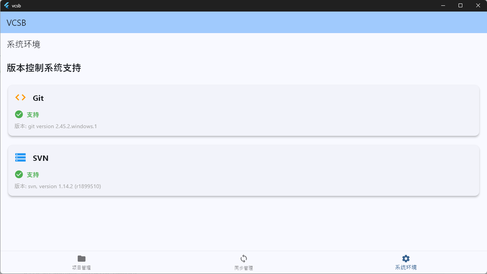

# vcsb

#### 介绍

Ai Generated Version-Control-System Bridge.

#### 现有截图

#### 功能说明

- 版本控制系统桥接，将一个版本控制系统更新到另一个版本控制系统
- 支持多种版本控制系统，如 Git, SVN 等

#### 细化说明

全局最上层tab页包含项目管理、同步管理和系统环境

1、项目管理：

- 项目信息维护（增删改）：项目名称、UUID（不必展示）、项目路径
- 项目仓库维护（增删改）：项目名称、UUID（不必展示）、仓库类型、仓库本地路径
  
2、同步管理：

- 同步方案维护（增删改）：方案包含多个源仓库到目标仓库的同步操作
  
3、系统环境：

- 检查当前环境是否支持git和svn命令